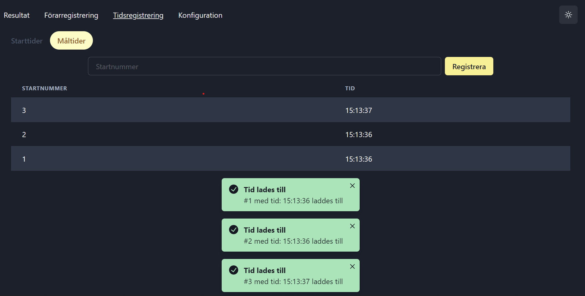

# RaceTimer (group5) - project for EDAF45

#### This is a project me and 9 others built whilst taking the course EDAF45 at LTH. The premise is to build an application that supports recording and measuring times for different kinds of races. 

#### Our group produced one of the most advanced applications out of all participants, with a fully fledged web application that runs Java / Node / Express on the backend and React on the frontend. I contributed the most in terms of lines of code, 2nd most in terms of commits to the repository and played an integral role in all parts of the project. I also proposed and implemented a completely new architecture for the Java portion of the backend which resulted in us progressing very rapidly. 
---
### The project can be run locally by running "npm run dev" in the dev folder, alternatively you can follow the instructions below for building and deploying.

## How to build / deploy
* To build, run ./build.sh on Linux and ./build.bat on Windows
* The complete project ends up in a zip file: "/build/distributions/team05-race-clock-vX.X.zip"
* After unzipping, run ./start.sh on Linux, ./start.bat on Windows to start the server

--- 
## Below are some pictures of the app in use.

<em>Results page, the result is generated by the java subproject, which is run through Express in node. (The web app is also available in light mode through the toggle in the top right)</em>

<em>Driver / participant registration</em>

<em>Configuration page</em>

<em>Time registration</em>

